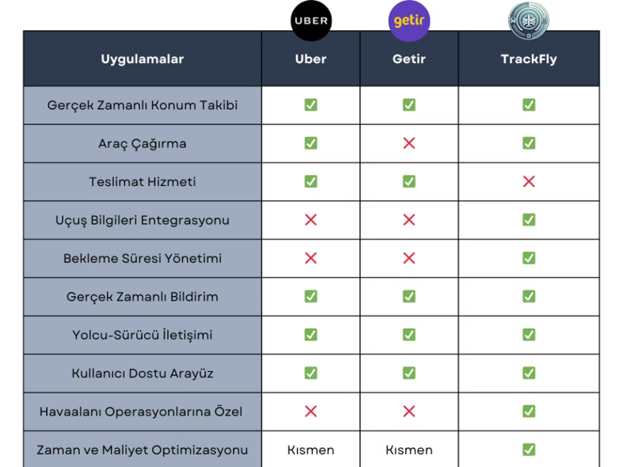
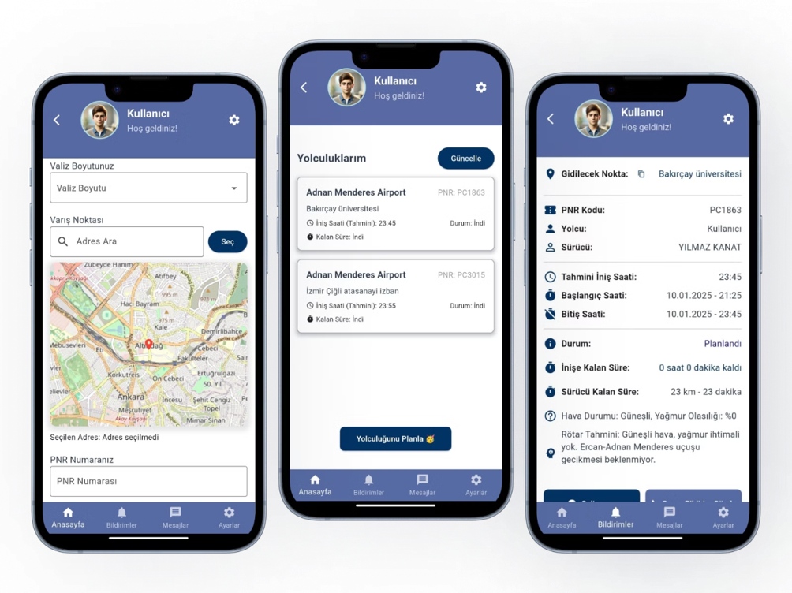
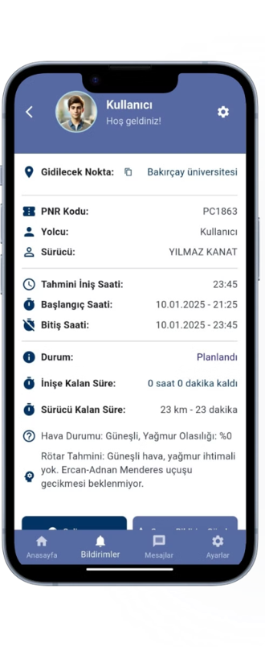

# 🛫 TrackFly - Uçuşa Entegre Araç Takip ve Bekleme Süre Yönetimi Uygulaması

TrackFly, havaalanı operasyonlarında **sürücülerin bekleme sürelerini en aza indirerek** verimliliği artırmayı ve **şirket kar oranını yükseltmeyi** hedefleyen bir mobil uygulamadır. **Gerçek zamanlı uçuş verileri** ile optimize edilen bu sistem, **Flutter** platformunda geliştirilmiş olup **kullanıcı dostu** bir arayüze sahiptir.

## 📌 Proje Hakkında
- **Geliştirme Teknolojileri:** Flutter, API Entegrasyonu, MySQL, Firebase, Yapay Zeka  
- **Platformlar:** Android, iOS, Web  

## 🚀 Amaç ve Hedefler
TrackFly, **uçuş ve araç takibini** optimize ederek:
- **Havaalanı operasyonlarındaki bekleme sürelerini azaltmayı,**
- **Sürücü ve araç verimliliğini artırmayı,**
- **Gerçek zamanlı uçuş verilerini kullanarak doğru tahminlerde bulunmayı,**
- **Sürücülerin ve yolcuların daha konforlu bir ulaşım deneyimi yaşamasını** amaçlamaktadır.

## 🛠 Kullanılan Teknolojiler

| Teknoloji  | Açıklama  |
|------------|----------|
| **Flutter** | Hızlı geliştirme ve **çapraz platform** desteği |
| **API Entegrasyonu** | **Gerçek zamanlı uçuş verileri** ve sürücü takibi için **Aviationstack API, Gemini API ve Weather API** kullanılmıştır |
| **MySQL** | Kullanıcı ve uçuş bilgilerini güvenli bir şekilde depolamak için |
| **Firebase** | Gerçek zamanlı veri senkronizasyonu için |
| **Figma** | Kullanıcı arayüzü tasarımı için |
| **Git** | Versiyon kontrolü ve takım çalışması için |

## 📌 TrackFly'in Çalışma Prensibi
1. **Kullanıcı, uygulama üzerinden bir yolculuk oluşturur.**  
   - Havaalanı bilgisi  
   - Uçak **PNR numarası**  
   - Valiz boyutu ve hedef konum bilgileri girilir.  

2. **API entegrasyonu ile uçuş bilgileri otomatik olarak çekilir.**  
   - Uçağın iniş saati  
   - Kalkış ve varış havaalanı bilgileri  
   - Gerçek zamanlı hava durumu  

3. **Sistem, sürücüyü optimize edilmiş şekilde yönlendirir.**  
   - **Sürücünün havalimanına uzaklığı (km ve dk) gösterilir.**  
   - **Yapay zeka, uçuş rötar tahminini analiz eder.**  
   - **Hava durumu verileri incelenerek yolculuk süresi optimize edilir.**  

4. **Yolcu, sürücüyle kolayca iletişime geçebilir.**  
   - **Yolculuk geçmişine ulaşabilir.**  
   - **Sürücünün güncel konumunu görebilir.**  

---

## 🧠 Yapay Zeka Destekli Özellikler
🔹 **Rötar Tahmini**:  
- Yapay zeka algoritmaları, **hava durumu verileri** ve uçuş bilgilerini analiz ederek rötar olasılığını hesaplar.  

🔹 **Hava Durumu Entegrasyonu**:  
- **Yağmur olasılığı, sıcaklık** gibi hava durumu verileri incelenerek, **sürücü rotaları optimize edilir**.  

---

## 📊 Deneysel Çalışmalar
- **Performans Testleri:** Ortalama gecikme süresi **5 saniyenin altında**, sistem stabil çalışmaktadır.  
- **Kullanıcı Arayüzü Testleri:** **Tüm ekranlarda uyumlu ve sorunsuz** bir deneyim sağlanmıştır.  
- **Stabilite Testleri:** **Eş zamanlı işlemlerde hata gözlemlenmemiştir.**  

---

## 📷 Ekran Görüntüleri
Aşağıya proje arayüzünden bazı görseller ekleyebilirsiniz:








_(Görselleri eklemek için `assets` klasörüne uygun PNG dosyalarını eklemelisiniz.)_

---

## 📥 Kurulum ve Kullanım
### 1️⃣ Gerekli Bağımlılıkları Yükleyin
Projeyi çalıştırmadan önce, aşağıdaki bağımlılıkları yükleyin:
```sh
flutter pub get
